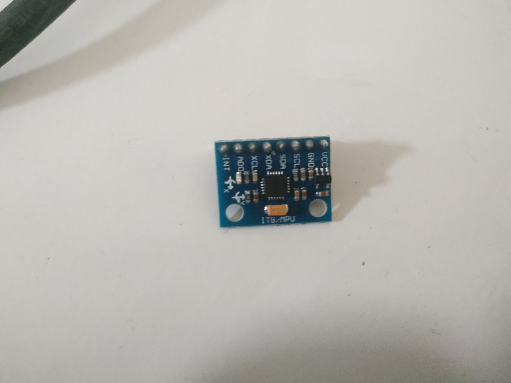
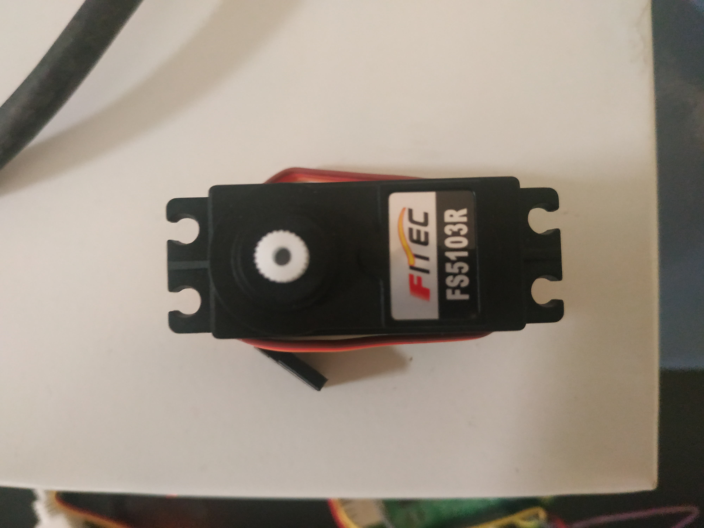

# IMU_servo_speed_control
In this mini-project we implemented a DC motor bi-directional speed control based on MPU 6050 readings. The continuous servo motor will speed up as the pitch angle increases and vice versa while the roll angle is below 45 degree. Here's a video of the projcet in motion: 

## Prior requirements:
AngleMeterAlpha.py: This script is responsible for reading the gyroscope and accelerometer data from the MPU from their respective addresses. Basically it includes a class with member functions responsible for initializing and interfacing the I2C bus and obtaining the values stored in the MPU 6050 registers which contain the values for orientation and acceleration in 3d space. 

kalman.py: This script takes the readings from the previous file and filters the data to produce reasonable results to work with

## speed_control_main.py

In this script we control the speed of the servo motor using the data from the MPU. This is done through a PWM signal which is controlled through the the readings from the MPU. As the pitch angle increases, the PWM singal has a wider pulse up to a certain adjustable point at which the servo starts going in the opposite direction. This is the case for all angles except when the roll angle has a value bigger than 45 degrees. 
#### speed control in motion:
https://drive.google.com/file/d/1e2IDNRZsvWtSsizygtWvzXyni6FBNiSW/view?usp=sharing

## position_control_main.py

In this script we control the position (angle) of the servo motor using the data from the MPU. This can be thought of as mapping the MPU angle to the angle of the servo for all angles between [90 : 270]. This mpu pitch angle is always mapped to the servo position except when the roll angle has a value bigger than 45 degrees. 

#### position control in motion:
https://drive.google.com/open?id=1U7zxPCbCknI2KXv5ue7fOPjWVnTrk6C1

## Hardware: 
- Raspberry pi 3 model B v1.2
- MPU 6050.

    
     
     ***Datasheet:*** https://components101.com/sites/default/files/component_datasheet/MPU6050-DataSheet.pdf
### Position control:
- S-91BB servo. 
  
  
### Speed control:
- FS5103R continuous servo. 

    
    
    ***Datasheet***: https://media.digikey.com/pdf/Data%20Sheets/Adafruit%20PDFs/154_Web.pdf
